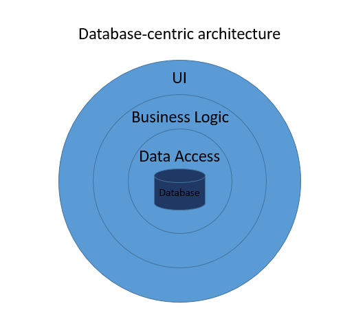

## Three-layer Database-centric Architecture also known as Classic 3-layer/tier

The three layers are as follows:

1. Data Access / The database - the center of the model.
2. Business Logic - around he center.
3. UI / Presentation - user interface - around the business logic.

