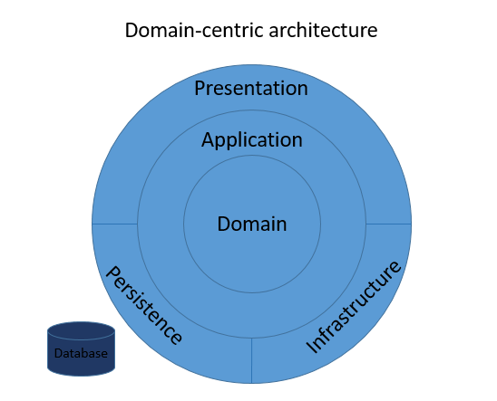

## Domain-centric Architecture

1. Domain - the center of the architecture.
2. Application - around the center/domain.
3. Presentation, Infrastructure, Persistence - around the application.

Unlike the Database centric architecute, here the domain is what is leading and the persistence (database) is detail.

