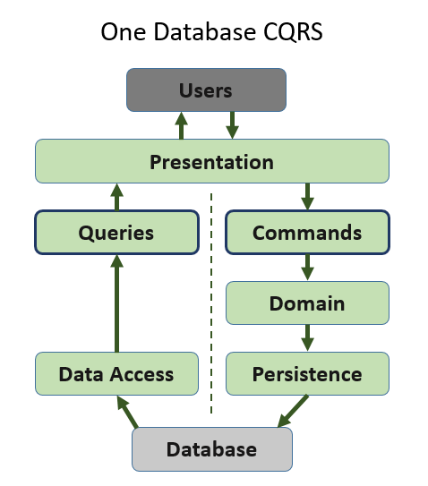

## Command Query Responsibility Segregation

CQRS is targeting separating the commands and queries.

---

## CQ in CQRS

- command - Alter/modify state (it does something). Doesnt return data/value. From CRUD operations command includes CUD operations.
- query - Doesnt alter/modify state (it answers a question). Returns data/value. From CRUD operations query includes R operations.

---

## CQRS types

#### One Database CQRS

#### Two Databases CQRS

#### Event sourcing CQRS

---

## CQRS vs DDD architecture

---

#### Article

Read also [here](https://martinfowler.com/bliki/CQRS.html) for more info and examples.
